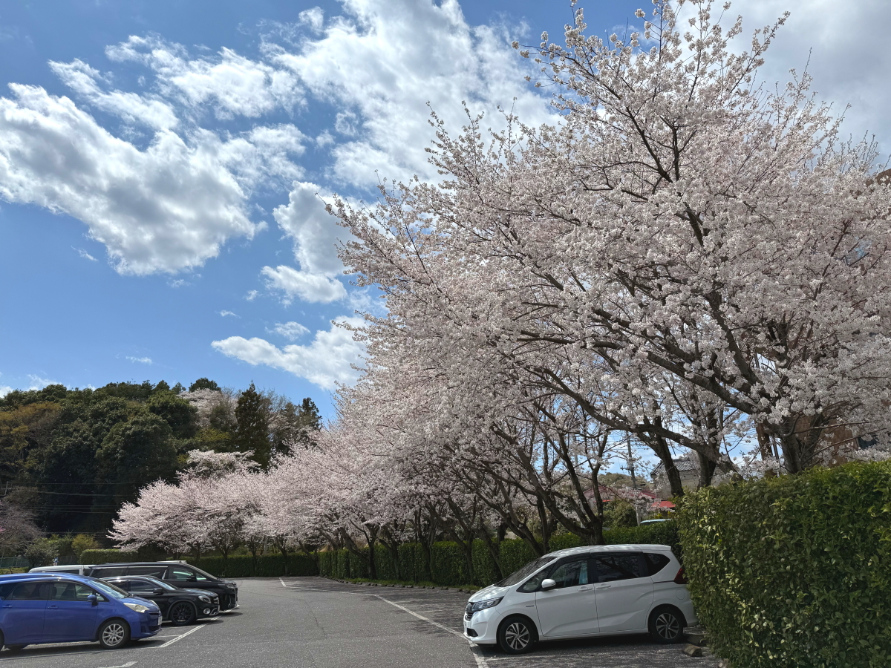

# 20250409_tochigi

<html>
<head>

<meta charset="UTF-8">
<meta http-equiv="Content-Type" content="text/html; charset=UTF-8">
<meta http-equiv="X-UA-Compatible" content="IE=EmulateIE10" />
<meta http-equiv="X-UA-Compatible" content="IE=edge">

<meta name="viewport" content="width=device-width, initial-scale=1.0">

<!--ここから上はお決まりの定型文です-->

<!--ここからが表現の書式などを決めるcssという部分-->

<link href="https://cdnjs.cloudflare.com/ajax/libs/lightbox2/2.7.1/css/lightbox.css" rel="stylesheet">

</head>

<body>

モバイル端末をお使いの場合は、画面を横向きにすると
より見やすくご覧頂けます。

<!--ここ上は、ほぼそのまま使います！-->

<!--QRコードの挿入例-->

 アクセス用QRコード

<marquee direction="left" scrollamount="20" width="30%">(^_^)/~alis</marquee>

<!--流れ文字の挿入例-->
<h1><marquee behavior="left">!!! 2025/04/09、宇都宮市内ブライダル衣装レンタル屋さんの駐車場では桜が満開!!!</marquee></h1>

                          

<!--ここから下が、本体部分-->

    
<h2>宇都宮市内、「ブライダルギャラリーアニバーサリー」さん</h2>
<iframe src="https://www.google.com/maps/embed?pb=!4v1744174141555!6m8!1m7!1sKrBuC4B12pfDUX0IqcYIWg!2m2!1d36.58011637998672!2d139.8900534524085!3f174.78559079911898!4f1.1305792803639605!5f0.7820865974627469" width="600" height="450" style="border:0;" allowfullscreen="" loading="lazy" referrerpolicy="no-referrer-when-downgrade"></iframe> 

<h2>奥の駐車場で桜が満開になっているのが見えて、入り口には粋な看板</h2>

    
<h2>スマホで撮影していたら「どうぞ楽しんでいってください」とお声がけいただきました</h2>

    
<h2>スマホでは申し訳ないので車からデジタル一眼取り出して撮り直し</h2>

    
<h2>駐車場西側の桜並木は、樹齢25年とのこと</h2>

    

         

   
<h2>以上、宇都宮市内ブライダル衣装レンタルショップ「はまつ斉苑」さんの桜でした。 ここまでご覧いただきありがとうございました。</h2>

     

   

         

  

      

<!--本体はここまで-->

<!--画面に空白地帯を作って、背景が見えるようにしています-->
                                              

<!-- フッタ -->
<footer>

Copyright 2025/04/09 alis @Tochigi

</footer>

<!--HPにさまざまなJavaScriptを呼び込むための書式-->

    
    </body>
    
</html>
